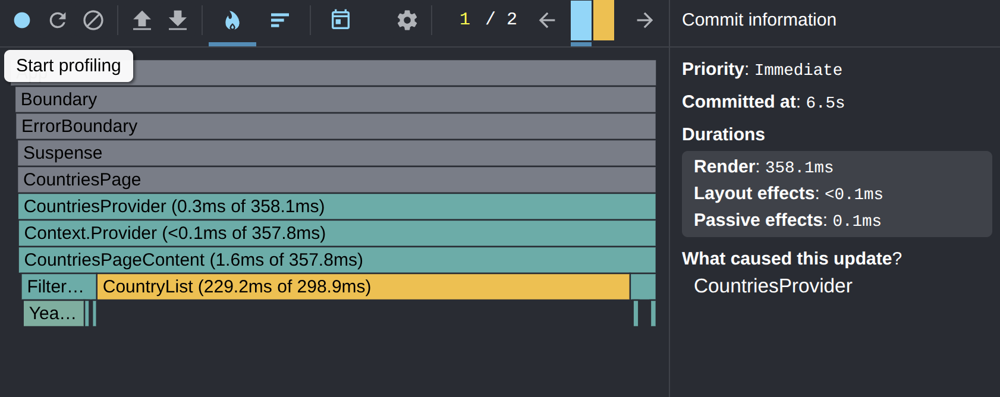
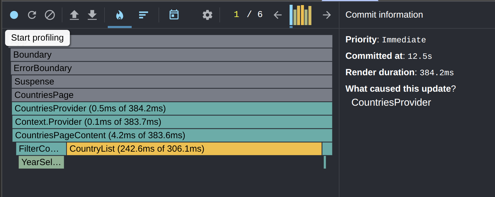
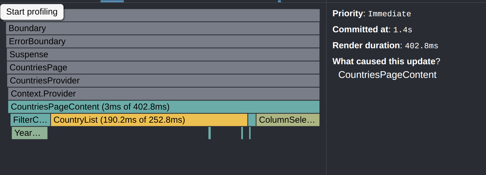
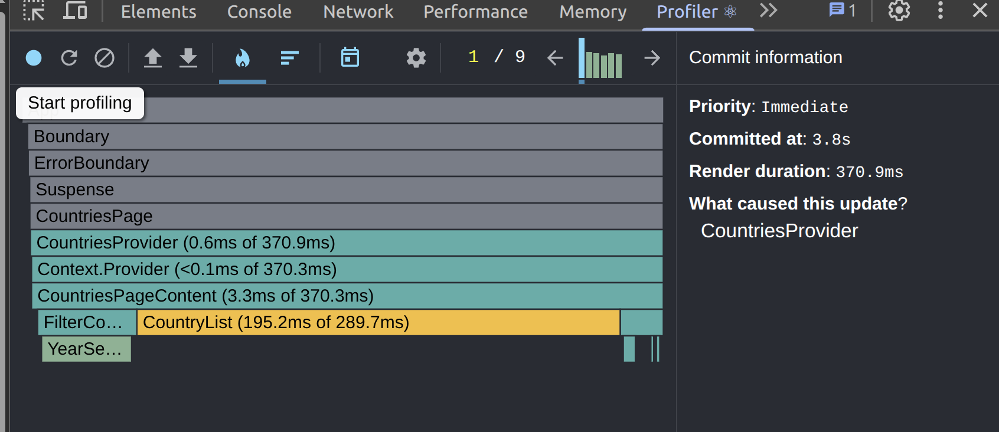

# React Performance

Initial profiling was performed using **React DevTools Profiler**.  
The following interactions were measured:

- However, **not all optimizations were fully completed**.  
  Profiling after changes was only partially performed, therefore commit times remain **TBD** in the table below.

#### Before & After optimizations 
| Action      | Commit ms (before → after) | Top component (before → after) | Notes                          |
|-------------|----------------------------|--------------------------------|--------------------------------|
| Year change | 358 → TBD                  | CountryList ~229 → TBD         | Update triggered by CountriesProvider |
| Sort by population | 384 → TBD                  | CountryList ~243 → TBD         | Sorting by population of selected year |
| Column selection (+5) | 403 → TBD                  | CountryList ~190 → TBD         | Adding ~5 extra columns in the modal |
| Search "Albania" | 371 → TBD                 | CountryList ~195 → ~195        | Search triggers filter + list rerender |

- Year change — Flamegraph: 
- Sort — Flamegraph: 
- Columns — Flamegraph: 
- Search — Flamegraph: 

- Current optimization reduced some unnecessary re-renders, but there is still room for improvement:
    - Further memoization of derived data structures
- Due to time constraints, final profiling results were not collected for all interactions. 
